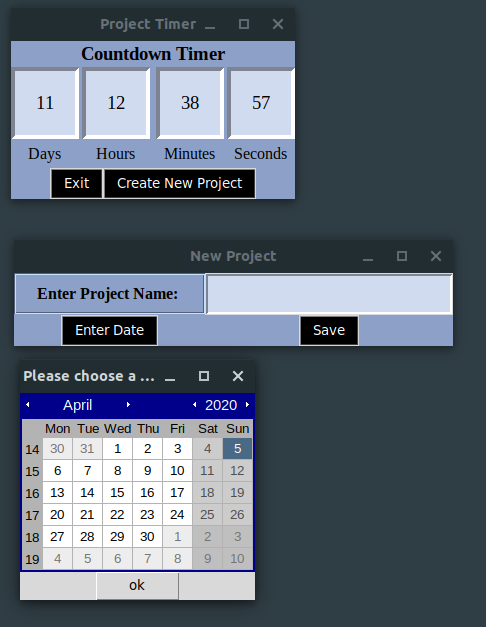

# Project Timer

This is a project timer. A simple UI that counts down the time you allocated for your project to be completed.




## Getting Started

Download teh EXE file. When first running the program you'll be asked to enter project information. After the information is entered, restart. A pickle file will be created in the directory you keep the EXE


### Prerequisites

What things you need to install the software and how to install them

```
Give examples
```

### Installing

A step by step series of examples that tell you how to get a development env running

Say what the step will be

```
Give the example
```

And repeat

```
until finished
```

End with an example of getting some data out of the system or using it for a little demo


## Built With

* [tkinter](https://docs.python.org/3/library/tkinter.html) - The python UI package used

## Versioning

For the versions available, see the [ctd1077](https://github.com/ctd1077/Project-Clock-Timer). 

## Authors

* **C. Deatherage** - *Initial work* - [ctd1077](https://github.com/ctd1077)